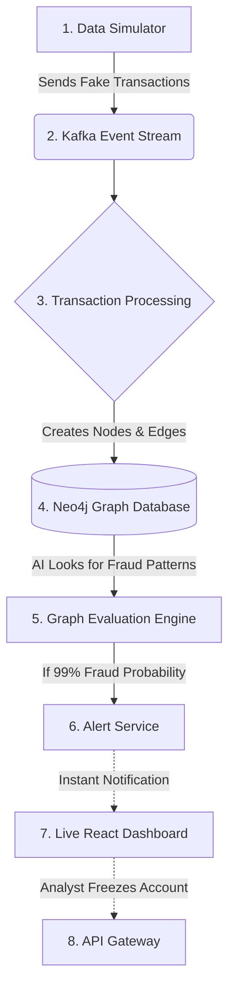

# GuardUPI: Real-Time Fraud Detection Platform 🛡️

**GuardUPI** is an advanced platform designed to instantly detect and catch fraudulent UPI (Unified Payments Interface) transactions. 

Just like a bank monitors credit card swipes for suspicious activity, GuardUPI monitors thousands of digital UPI transfers a second. By looking at *who* is sending money to *whom*, it builds a live map of transactions and flags complex fraud rings that simple rule-based systems might miss.

---

## 📖 Example Scenario: The "Money Mule" Ring

To understand why GuardUPI is necessary, consider a common fraud tactic:
1. **The Setup**: A scammer tricks a victim into sending ₹5,000 via UPI. 
2. **The Wash**: To avoid detection, the scammer immediately splits that ₹5,000 and forwards it to 5 different "mule" accounts (₹1,000 each). 
3. **The Consolidation**: Those 5 mule accounts then forward the money to a final offshore or untraceable master account.

**How GuardUPI catches this:** 
Traditional systems only look at the first hop (Victim → Scammer) and might think it's a normal payment. **GuardUPI** uses a Graph Database (Neo4j) and AI (GraphSAGE) to look at the *entire network at once*. It instantly recognizes the "split-and-recombine" pattern, flags all 7 accounts involved, and freezes the master account before the money can be withdrawn!

---

## 🔄 How It Works (System Workflow)

Here is a simple map of how data moves through GuardUPI in real-time:



1. **Transaction Simulation**: A script (`data_pump.py`) acts like millions of users making UPI transfers.
2. **Streaming**: These transfers are passed into **Kafka** (a high-speed messaging queue).
3. **Graphing**: The backend takes these transfers and maps them as points in **Neo4j**. 
4. **AI Evaluation**: The AI immediately checks if the shape of the graph looks like a scam.
5. **Dashboard Alert**: If fraud is detected, an alert is pushed live to the React website via WebSockets, so a Fraud Analyst can take action.

---

## 🛠️ Tech Stack

*   **Frontend**: React, Vite, TailwindCSS (for a beautiful, fast UI)
*   **Backend**: Python, FastAPI (for handling data quickly)
*   **AI & Graphing**: Neo4j, NetworkX, GraphSAGE
*   **Infrastructure**: Docker Compose, Kafka, Zookeeper, Redis, PostgreSQL

---

## 🚀 Quickstart Guide: Running It Locally

Follow these simple steps to start the whole platform on your computer.

### Step 1: Start the Background Infrastructure (Databases)
You need Docker installed to launch the databases (including PostgreSQL) and message queues.
```bash
cd infrastructure
docker-compose up -d
```
*(Wait 30-60 seconds for Neo4j, Kafka, Redis, and PostgreSQL to fully start in the background).*

**Infrastructure Connection Details:**
Once the Docker containers are running, you can connect to any of the local resources using these default development credentials:

* **PostgreSQL** (Relational Data): `localhost:5432` | User: `root` | Pass: `password123`
* **Neo4j** (Graph Database): `localhost:7474` (Web UI) or `localhost:7687` (Bolt) | User: `neo4j` | Pass: `password123`
* **Redis** (Caching & State): `localhost:6379` | No password required.
* **Kafka** (Message Broker): `localhost:9092` | (Zookeeper runs on `2181`).

### Step 2: Start the Backend Microservices
Open a terminal for the services you want to run. For example, to start the authentication service:
```bash
cd backend/auth-service
pip install -r requirements.txt
uvicorn main:app --reload --port 8001
```

### Step 3: Start the Frontend Dashboard
Open a new terminal to start the React website:
```bash
cd frontend
npm install
npm run dev
```
Open `http://localhost:5173` in your browser. Use the quick-fill demo credentials to log in as any role!

### Step 4: Generate Live Data
To watch the dashboard light up with transactions, run the data simulator in a new terminal:
```bash
cd upi-fraud-platform
python data_pump.py
```
